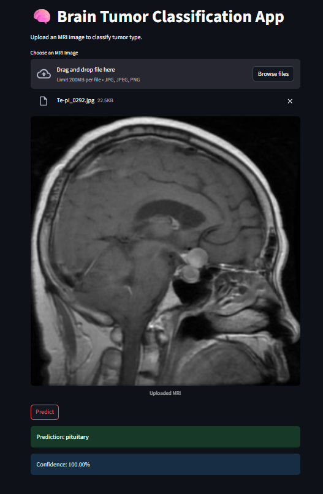

#  Brain Tumor Classification (Streamlit + PyTorch)

A **deep learning-powered web application** for **Brain Tumor Classification** using **PyTorch (ResNet50)** and **Streamlit**.  
Upload an MRI scan and the model will predict the tumor type along with a confidence score.  

---
### Preview Of The Streamlit App



---

##  Table of Contents
- [ Features](#-features)
- [ Project Structure](#-project-structure)
- [ Installation](#️-installation)
- [Running the App](#️-running-the-app)
- [ Usage](#-usage)
- [ Model Details](#-model-details)
- [ Notes](#-notes)

---

## Features
- **Upload MRI Images** → Supports `.jpg`, `.jpeg`, and `.png` files.  
- **AI Predictions** → Classifies images into one of four categories:  
  - `Glioma`  
  - `Meningioma`  
  - `Pituitary`  
  - `No Tumor`  
- **Confidence Score** → Displays probability (%) for the predicted class.  
- **Web Interface** → Clean, responsive UI built with **Streamlit**.  
- **Modular Design** →  
  - `main.py` → Handles frontend UI.  
  - `prediction_helper.py` → Handles model loading & inference.  

---

## Project Structure
- Tumor Recognization
- main.py
- prediction_helper
- README.md
- requirements.txt
- Tumor_prediction.pth


---

## ⚙️ Installation
```bash
    git clone https://github.com/your-username/brain-tumor-classification.git
    cd brain-tumor-classification
    pip install -r requirements.txt
```

## Running The App
```bash
   streamlit run main.py
```

## Usage

- Launch the Streamlit app in your browser.
- Upload an MRI image of the brain.
- Click on Predict.
- The app will show:
- Tumor Type (e.g., Glioma / No Tumor)
- Confidence Score (%)

## Model Details
- Base Architecture: ResNet50 (pre-trained on ImageNet).
- Training Strategy:
- Frozen early layers, fine-tuned deeper layers.
- Final fully-connected layer replaced with 4-class classifier.
- Input Preprocessing:
- Resize to 224×224
- Normalize with ImageNet mean & std.
